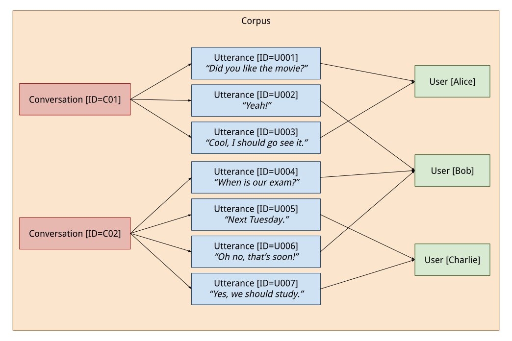

Core Concepts
=============

At the heart of ConvoKit are two key concepts: *Corpora* and *Transformations*. At a high level, a *Corpus* represents a collection of one or more conversations, while a *Transformation* represents some action or computation you can do to a corpus. To draw an analogy to language, corpora are the nouns of ConvoKit, and transformations are the verbs. While this architecture may seem simple, combining various corpora and transformations can allow you do to surprisingly complex things. This page covers the details of corpora and transformations and how you can use them.

Corpus
------

A Corpus is a collection of conversations, each of which is made up of one or more participants (henceforth referred to as *users*) who say things (henceforth referred to as *utterances*) to each other. This intuitive definition is represented in ConvoKit by the following class hierarchy: the :py:class:`~convokit.model.Corpus` class stores a list of :py:class:`~convokit.model.Utterance` objects, which may be grouped together into one or more instances of :py:class:`~convokit.model.Conversation`, and each :py:class:`~convokit.model.Utterance` has an associated :py:class:`~convokit.model.User`. These relationships are illustrated below:

As we can see from this example, the Corpus contains Conversations, Utterances, and Users. Each Conversation points to one or more Utterances that make up the conversation, and each Utterance points to the User who authored it. We also observe the following properties:

* Conversations and Utterances are identified by IDs. An ID can be any arbitrary string, as long as there is a unique ID for each Conversation and Utterance.
* Users are identified by a human-readable name. This is done to reflect the nature of most online conversation platforms (a primary domain that ConvoKit is designed for), where each user posts comments under a unique username.
* A User can be part of multiple Conversations

Each class in the hierarchy also stores useful information for analysis purposes. For instance, each Utterance object stores the text (what was said) and timestamp (when it was said) of the Utterance. A full listing of basic properties stored by each class can be found in the full documentation (see :doc:`model`). In practice, however, when you use ConvoKit for your own task, you will probably need to keep track of additional task-specific properties beyond the basic ones. ConvoKit provides a mechanism for doing this: *metadata*.

Metadata
^^^^^^^^

In everyday usage, "metadata" simply refers to information for identifying and organizing data; e.g., timestamps. However, in the context of ConvoKit, "metadata" has a slightly different meaning: it refers to any properties (beyond the basic ones provided by ConvoKit) of a Corpus, Conversation, Utterance, or User that you might want to keep track of when doing some task. For instance, if your task is to compare the sentiment of Reddit comments to the age of the users who wrote them, you would want to keep track of when each user first joined Reddit. The User class does not automatically store this, so you would add it as metadata.

Each of the four classes in the hierarchy contains a ``.meta`` field, which is a dictionary that maps from metadata name to value. In the previous example, you would want a User-level metadata entry called something like "start-date". So, if ``usr`` is an instance of User representing a Reddit user who joined on April 1, 2008, ``usr.meta`` would be a dictionary looking like ``{"start-date": "04-01-2008"}``. While for simplicity we have represented the start date as a string, in practice there are no restrictions on what kinds of objects can be stored as metadata, so you could have chosen a fancier representation, like a Pandas timestamp.

Note that all of the datasets that ship with ConvoKit have some metadata already present, usually related to the task that the dataset was originally designed for. To learn what metadata is present in a Corpus, you can use the :py:func:`~convokit.util.meta_index` function.

Transformer
-----------

Of course, if we only had Corpus objects (merely large containers of data), we wouldn't really be able to do anything interesting. In practice, we need to manipulate the corpora in some way. This idea is represented in ConvoKit as the Transformer class. 

At a high level, a Transformer is an object that takes in a Corpus and gives back the same Corpus with some modifications done to it. In almost all cases, these modifications will take the form of changed or added metadata. For example, one kind of Transformer built in to ConvoKit is the TextParser, which is designed to add dependency parses to a Corpus. When you run the TextParser on a Corpus, it adds to each Utterance a metadata entry called "parsed", whose value is the dependency parse of that Utterance's text (represented as a `SpaCy Doc <https://spacy.io/api/doc>`_). The modified Corpus is then returned so you can continue to do other things with it (including running other Transformers).

Implementation-wise, Transformer is an `abstract class <https://docs.python.org/3/library/abc.html>`_ - that is, you cannot directly create a Transformer object. Instead, specific Corpus manipulations are coded as individual classes, each one `inheriting <https://docs.python.org/3/tutorial/classes.html#inheritance>`_ from Transformer. If you are not super familiar with Python inheritance, don't worry - all you need to know is that each manipulation of a Corpus is represented as an individual class, but these classes all "look the same" in that they have the same basic set of functions. Specifically, they all contain a ``fit`` function and a ``transform`` function. The ``fit`` function is used to prepare/train the Transformer object with any information it needs beforehand; for example, a Transformer that computes bag-of-words representations of Utterances would first need to build a vocabulary. The ``transform`` function, as its name implies, is the function that actually runs the Transformer. So in the TextParser example, to actually apply the TextParser to a Corpus, you would run::

    c_parsed = p.transform(c)

Where ``p`` is a TextParser object and ``c`` is a Corpus object.

A single Transformer on its own might not do much, but because Transformers return the modified Corpus, you can chain multiple Transformers together to achieve highly complex outputs. For instance, after you have applied the TextParser to your Corpus, you can take the modified Corpus and run another Transformer on it that uses the parses to perform some more complicated task, like named entity recognition. In general, the code for chaining together arbitrary numbers of Transformers takes the following form::

    # Assume that transformer1,transformer2,... have been previously initialized as instances of Transformer subclasses
    
    base_corpus = Corpus(...)

    corpus1 = transformer1.transform(base_corpus)
    corpus2 = transformer2.transform(corpus1)
    corpus3 = transformer3.transform(corpus2)
    # ...and so on

As previously mentioned, Transformers are the "verbs" of ConvoKit - they are where the conversational analysis actually happens. In fact, all of the conversational analysis functionality of ConvoKit (computing linguistic coordination, finding question types, etc.) is implemented as Transformers.

Interoperability with scikit-learn
^^^^^^^^^^^^^^^^^^^^^^^^^^^^^^^^^^

Readers who are familiar with the `scikit-learn <https://scikit-learn.org/stable/>`_ package may have noticed that the Transformer class we just described looks almost identical to scikit-learn's own `Transformer <https://scikit-learn.org/stable/modules/generated/sklearn.base.TransformerMixin.html>`_ class. This is no coincidence - the ConvoKit philosophy of encoding operations as Transformers was directly inspired by scikit-learn. Besides making the two libraries philosophically consistent, this also has several practical benefits. The process of chaining multiple Transformers that we previously described can actually be done in one line of code using scikit-learn's `Pipeline <https://scikit-learn.org/stable/modules/generated/sklearn.pipeline.Pipeline.html>`_ functionality (of course, users who are unfamiliar with scikit-learn or simply don't want to introduce it as a dependency in their project can always manually chain transformers as shown in the original code example). It also means that you could theoretically create a Pipeline that mixes together both ConvoKit and scikit-learn Transformers, though to do this you would need to implement a Transformer that takes in a ConvoKit Corpus and returns something that scikit-learn understands, like a Pandas DataFrame or NumPy array.