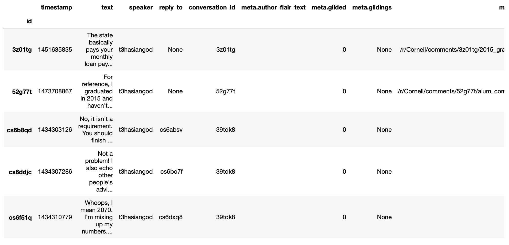

=====================
Introductory tutorial
=====================

Setup
=====

This toolkit requires Python >=3.6.

If you haven't already,

#. Download the toolkit: ``pip3 install convokit``

#. Download Spacy's English model: ``python3 -m spacy download en``

#. Download nltk's punkt tokenizer: ``import nltk; nltk.download('punkt')`` (in a ``python`` interactive session)

**If you encounter difficulties with installation**, check out our `Troubleshooting Guide <https://convokit.cornell.edu/documentation/troubleshooting.html>`_ for a list of solutions to common issues.

A brief note
============

This is a practical hands-on introduction ConvoKit. Read our description of ConvoKit's :doc:`architecture </architecture>` for an understanding of the higher-level design decisions for this package.

We **recommend** following our `interactive Colab notebook <https://colab.research.google.com/github/CornellNLP/Cornell-Conversational-Analysis-Toolkit/blob/master/examples/Introduction_to_ConvoKit.ipynb>`_, which contains the same steps as this tutorial, but allows for the full range of outputs (e.g. graphs, tables) to be displayed.

Tutorial
========

This tutorial introduces ConvoKit: a conversational analysis toolkit that offers:

1. A unified representation for conversational data

2. A language for describing manipulations of such data

In this notebook, we cover the key ideas behind ConvoKit, as well as some of its most commonly used methods and functions. Read our documentation for an exhaustive coverage of ConvoKit's classes and functions.

Let us start an interactive session (e.g. with ``python`` or ``ipython``) and import Convokit.

>>> import convokit

A Corpus represents a conversational dataset. We typically begin our analysis by loading a Corpus. A list of existing datasets already in ConvoKit format can be found `here <https://convokit.cornell.edu/documentation/datasets.html>`_.

A growing list of many other conversational datasets covering a variety of conversational settings are available in ConvoKit, such as face-to-face (e.g. the `Intelligence Squared Debates corpus <https://convokit.cornell.edu/documentation/iq2.html>`_), institutional (e.g. the `Supreme Court Oral Arguments corpus <https://convokit.cornell.edu/documentation/supreme.html>`_), fictional (e.g. the `Cornell Movie Dialog Corpus <https://convokit.cornell.edu/documentation/movie.html>`_), or online  (e.g. all talkpage conversations on `Wikipedia Talk Pages <https://convokit.cornell.edu/documentation/wiki.html>`_ and a full dump of `Reddit <https://convokit.cornell.edu/documentation/subreddit.html>`_).

For this tutorial, we will primarily be using the *r/Cornell* subreddit corpus to demo various ConvoKit functionality, and occasionally the `Switchboard Dialog Act Corpus <https://convokit.cornell.edu/documentation/switchboard.html>`_ (a collection of anonymized five-minute telephone conversations) as a contrasting dataset.

>>> from convokit import Corpus, download
>>> corpus = Corpus(download('subreddit-Cornell'))
>>> switchboard_corpus = Corpus(download('switchboard-corpus'))

Corpus components: Conversations, Utterances, Speakers
------------------------------------------------------

Every Corpus has three main components: `Conversations <https://convokit.cornell.edu/documentation/conversation.html>`_, `Utterances <https://convokit.cornell.edu/documentation/utterance.html>`_, and `Speakers <https://convokit.cornell.edu/documentation/speaker.html>`_. Just as in real life, in ConvoKit, Conversations are some sequence of Utterances, where each Utterance is made by some Speaker.

>>> corpus.print_summary_stats()
Number of Speakers: 7568
Number of Utterances: 74467
Number of Conversations: 10744

Each component has a consistent data format, consisting of a set of *primary data fields* and *metadata attributes*.

**Primary data fields** are for information that is central to every Conversation, Utterance, and Speaker object. This includes IDs for the objects, and for Utterances specifically, there are other fields such as: text, timestamp, reply_to (the ID of the Utterance being responded to).

>>> # Let's see this in a random utterance from the r/Cornell Corpus
>>> utt = corpus.random_utterance()
>>> print(utt)
Utterance('id': 'ctj0ssa', 'conversation_id': 3etgwd, 'reply-to': 3etgwd, 'speaker': Speaker('id': KCSunshine111, 'meta': {'num_posts': 1, 'num_comments': 18}), 'timestamp': 1438095153, 'text': "My good experiences with CAPS were with the PsyD (I think?) student residents. While they are only there on a yearly rotation program, I've found them to have the highest degree of professionalism, understanding, and empathy for students either mental illness.  \n\nMy bad experiences were with anyone else. Especially the MSWs and similar. I felt condescended, treated like a child. One man actually thought giving me handouts in comic sans font would help me.  \n\nPersonally, I think it's worth finding one of the resident doctors and having an initial session with them. Feel them out. You are under no obligation to tell them everything and it is even okay to express that you aren't comfortable with that idea yet. How they respond is the important part. If you feel pressured or if they do not seem willing to listen to you as a separate individual (versus you being just one of many who have X diagnosis), stop seeing them. But I think you might be able to find someone at CAPS who is worth talking to. \n\nEdit: sorry, advice goes for your friend, not you! ", 'meta': {'score': 1, 'top_level_comment': 'ctj0ssa', 'retrieved_on': 1440134909, 'gilded': 0, 'gildings': None, 'subreddit': 'Cornell', 'stickied': False, 'permalink': '', 'author_flair_text': ''})

>>> # primary data fields
>>> print("ID:", utt.id, "\n")
ID: ctj0ssa
>>> print("Reply_to:", utt.reply_to, "\n")
Reply_to: 3etgwd
>>> print("Timestamp:", utt.timestamp, "\n")
Timestamp: 1438095153
>>> print("Text:", utt.text, "\n")
Text: My good experiences with CAPS were with the PsyD (I think?) student residents. While they are only there on a yearly rotation program, I've found them to have the highest degree of professionalism, understanding, and empathy for students either mental illness.
My bad experiences were with anyone else. Especially the MSWs and similar. I felt condescended, treated like a child. One man actually thought giving me handouts in comic sans font would help me.
Personally, I think it's worth finding one of the resident doctors and having an initial session with them. Feel them out. You are under no obligation to tell them everything and it is even okay to express that you aren't comfortable with that idea yet. How they respond is the important part. If you feel pressured or if they do not seem willing to listen to you as a separate individual (versus you being just one of many who have X diagnosis), stop seeing them. But I think you might be able to find someone at CAPS who is worth talking to.
Edit: sorry, advice goes for your friend, not you!
>>> print("Conversation ID:", utt.conversation_id, "\n")
Conversation ID: 3etgwd
>>> print("Speaker ID:", utt.speaker.id)
Speaker ID: KCSunshine111

**Metadata attributes** are for additional features/labels for these component objects that might not generalize across corpora.
Every component object (i.e. Speaker, Conversation, Utterance) has its own metadata. These can be accessed through the `.meta` field of these objects.

>>> utt.meta
{'score': 1,
 'top_level_comment': 'ctj0ssa',
 'retrieved_on': 1440134909,
 'gilded': 0,
 'gildings': None,
 'subreddit': 'Cornell',
 'stickied': False,
 'permalink': '',
 'author_flair_text': ''}

For example, we see that Reddit Utterances have Reddit-specific metadata, such as comment score (from upvotes / downvotes) and subreddit this Utterance belongs to.

Conversations and Utterances have a similar format:

>>> convo = corpus.random_conversation()
>>> print(convo)
Conversation('id': '32valu', 'utterances': ['32valu'], 'meta': {'title': 'bedroom available in downtown apartment, Cornell grad students preferred. Sublet or full lease', 'num_comments': 0, 'domain': 'self.Cornell', 'timestamp': 1429230425, 'subreddit': 'Cornell', 'gilded': 0, 'gildings': None, 'stickied': False, 'author_flair_text': ''})
>>> convo.meta
{'title': 'bedroom available in downtown apartment, Cornell grad students preferred. Sublet or full lease',
 'num_comments': 0,
 'domain': 'self.Cornell',
 'timestamp': 1429230425,
 'subreddit': 'Cornell',
 'gilded': 0,
 'gildings': None,
 'stickied': False,
 'author_flair_text': ''}

>>> # We use Switchboard's speakers as they have more interesting metadata
>>> speaker = switchboard_corpus.random_speaker()
>>> print(speaker)
Speaker('id': 1657, 'meta': {'sex': 'FEMALE', 'education': 2, 'birth_year': 1947, 'dialect_area': 'NORTH MIDLAND'})
>>> speaker.meta
{'sex': 'FEMALE',
 'education': 2,
 'birth_year': 1947,
 'dialect_area': 'NORTH MIDLAND'}

**Vectors in ConvoKit**:
Vector data is also easy to use in ConvoKit and we provide first-class support for integrating vector data with Corpus components.
Read our `introduction to vectors in ConvoKit <https://github.com/CornellNLP/Cornell-Conversational-Analysis-Toolkit/blob/master/examples/vectors/vector_demo.ipynb>`_ for more details.

What else can we do with the Corpus object?
-------------------------------------------

**Fetching components by ID**

>>> # We can fetch individual objects by ID
>>> # corpus.get_conversation('7bir0w')
>>> # corpus.get_utterance('dsyd46r')
>>> corpus.get_speaker('ulysses2014')
Speaker({'obj_type': 'speaker', '_owner': <convokit.model.corpus.Corpus object at 0x14e7ca150>, 'meta': {}, '_id': 'ulysses2014'})

>>> # We can check if the Corpus contains an object with a specified ID
>>> # corpus.has_conversation('7bir0w')
>>> # corpus.has_utterance('dsyd46r')
>>> corpus.has_speaker('ulysses2014')
True

**Iterating through Corpus components**

We can iterate through any of these components, though we exit the for-loop early here to avoid excessive output:

>>> for utt in corpus.iter_utterances():
>>>     print(utt.text)
>>>     break
I was just reading about the Princeton Mic-Check and it's getting [national press](http://www.bloomberg.com/news/2011-12-29/princeton-brews-trouble-for-us-1-percenters-commentary-by-michael-lewis.html).
I want to get a sense of what people felt like around campus. Anything interesting happen? Anything interesting coming up?

>>> for convo in corpus.iter_conversations():
>>>     print(convo.meta['num_comments'])
>>>     break
1

>>> for speaker in corpus.iter_speakers():
>>>     print(speaker.id)
>>>     break
reddmau5

**Generating component DataFrames**

>>> # We can even generate dataframes of each component
>>> # corpus.get_utterances_dataframe()
>>> # corpus.get_conversations_dataframe()
>>> switchboard_corpus.get_speakers_dataframe().head()

.. image:: img/speakers_dataframe.png

Component functionality
-----------------------

Each component object comes with its own set of methods and functions to enable data exploration and higher-level analyses.

**Inter-operability between components**

Each Conversation, Utterance, Speaker belongs to a single Corpus object. In addition, ConvoKit has been purposefully designed such that it is straightforward to navigate between these different components.

>>> # Consider this sequence of operations that highlight how to navigate between components
>>> utt = corpus.random_utterance()
>>> convo = utt.get_conversation() # get the Conversation the Utterance belongs to
>>> spkr = utt.speaker # get the Speaker who made the Utterance

>>> spkr_convos = list(spkr.iter_conversations())
>>> spkr_utts = list(spkr.iter_utterances())

>>> convo_spkrs = list(convo.iter_utterances())
>>> convo_utts = list(convo.iter_speakers())

To spell it out:

#. You can navigate from each Utterance to the Conversation it belongs to or the Speaker that made it.
#. You can navigate from each Speaker to the Utterances that they have made or the Conversations they have participated in.
#. You can navigate from each Conversation to the Utterances that compose it or the Speakers that participated in it.

This enables more sophisticated analyses such as tracking a Speaker's behavior across the Conversations they have participated in or characterizing a Conversation by the Utterances that form it.

**DataFrame representations from each component object**

In addition, because Conversations can be conceived of as collections of Utterances and Speakers, and Speakers collections of Utterances and Conversations, Conversations/Speakers have their own set of iterators (as shown above) and even support DataFrame generation:

>>> # spkr.get_conversations_dataframe()
>>> # convo.get_utterances_dataframe()
>>> # convo.get_speakers_dataframe()
>>> spkr.get_utterances_dataframe().head()

Conversation
------------

In particular, we want to highlight some of the functionality related to Conversation structure. The structure of a Conversation (i.e. who replies to whom) may not be straightforward to recreate from conversational data in most setups. In ConvoKit however, using the Utterance reply_to attribute, Conversations are automatically encoded with conversation structure.

>>> convo = corpus.get_conversation('7yy032')
>>> print(convo)
Conversation('id': '7yy032', 'utterances': ['7yy032', 'duk1rlx', 'duk1rrw', 'duk2cue', 'duk99zc', 'dukhv8f', 'dulmtzw', 'dum5ufw', 'dum629f', 'dum7epw', 'dupzllr', 'duqb609'], 'meta': {'title': 'CS minor advice?', 'num_comments': 11, 'domain': 'self.Cornell', 'timestamp': 1519150001, 'subreddit': 'Cornell', 'gilded': 0, 'gildings': None, 'stickied': False, 'author_flair_text': ''})

In this example, we can visualize the conversation's structure as follows:

>>> convo.print_conversation_structure()
smoothcarrot
    alated
        Darnit_Bot
        smoothcarrot
            RadCentrism
            alated
        l33tnerd
            alated
                l33tnerd
                    smoothcarrot
                        l33tnerd
    gandalf-the-gray

This corresponds exactly to how this post thread would look like in Reddit (smoothcarrot makes the post, while alated and gandalf-the-gray make top-level comments.) For each Utterance, just the Speaker's name is printed, for easy visualization of the thread structure, but we can configure this to print whatever we'd like for each Utterance.

(As a quick contrast, we print the structure of a Conversation from the Switchboard corpus, which reflects the structure of most offline conversations.)

>>> # Instead of printing the Speaker ID, we print the Utterance ID
>>> switchboard_corpus.get_conversation('4771-0').print_conversation_structure(lambda utt: utt.id)
4771-0
    4771-1
        4771-2
            4771-3
                4771-4
                    4771-5
                        4771-6
                            4771-7
                                4771-8
                                    4771-9
                                        4771-10
                                            4771-11
                                                4771-12
                                                    4771-13
                                                        4771-14
                                                            4771-15
                                                                4771-16
                                                                    4771-17
                                                                        4771-18
                                                                            4771-19
                                                                                4771-20
                                                                                    4771-21
                                                                                        4771-22
                                                                                            4771-23
                                                                                                4771-24
                                                                                                    4771-25

We get a 'linear' conversation that does not branch out into subtrees.

Back to the r/Cornell conversation, we can also configure this method to print the text at each Utterance, albeit truncated here for readability:

>>> convo.print_conversation_structure(lambda utt: utt.text[:80])
I'm an junior info science major and I'm thinking about completing a CS minor. H
    I don't think there's a straight answer to this. :/ Especially since "useful" wi
        What a *darn* shame..
***
^^Darn ^^Counter: ^^451121
        Do u think I should try to stick with 3110 this semester?
            I mean, you *could*. You missed a week, but the slides are online so you can cat
            It's up to you! Being behind one week isn't bad at all (there are always office
        I disagree with saying that you'll *never* use it. Functional ideas have made th
            I agree with you! Functional concepts can be found in many languages that are us
                Hmm, I guess my experience differs, then; I find myself using these concepts qui
                    Thanks for your insight.  I probably wont be continuing with 3110 this semester
                        I personally liked 3110 better, but this is very dependent on your own interests
    1. Go to office hours in general when you get stuck. Also you can pm me if you n

We can even verify this by finding the subreddit thread online:

>>> convo.print_conversation_structure(lambda utt: utt.id)
7yy032
    duk1rlx
        duk1rrw
        duk2cue
            duk99zc
            dum629f
        dukhv8f
            dum5ufw
                dum7epw
                    dupzllr
                        duqb609
    dulmtzw

>>> # Since the first utterance has ID '7yy032'
>>> first_utt = corpus.get_utterance('7yy032')
>>> first_utt.meta
{'score': 7,
 'top_level_comment': None,
 'retrieved_on': 1520570304,
 'gilded': 0,
 'gildings': None,
 'subreddit': 'Cornell',
 'stickied': False,
 'permalink': '/r/Cornell/comments/7yy032/cs_minor_advice/',
 'author_flair_text': ''}

Let's use the permalink to find the thread: https://old.reddit.com/r/Cornell/comments/7yy032/cs_minor_advice/

We see that this thread has been reconstructed accurately in this r/Cornell corpus.

**Conversation traversal**

Because the conversation tree structure is preserved, we can even:

>>> # Traverse the conversation tree in interesting ways
>>> print("Breadth first:")
>>> print([utt.speaker.id for utt in convo.traverse('bfs')],"\n")
Breadth first:
['smoothcarrot', 'alated', 'gandalf-the-gray', 'Darnit_Bot', 'smoothcarrot', 'l33tnerd', 'RadCentrism', 'alated', 'alated', 'l33tnerd', 'smoothcarrot', 'l33tnerd']

>>> print("Depth first:")
>>> print([utt.speaker.id  for utt in convo.traverse('dfs')],"\n")
Depth first:
['smoothcarrot', 'alated', 'Darnit_Bot', 'smoothcarrot', 'RadCentrism', 'alated', 'l33tnerd', 'alated', 'l33tnerd', 'smoothcarrot', 'l33tnerd', 'gandalf-the-gray']

>>> print("Preorder:")
>>> print([utt.speaker.id  for utt in convo.traverse('preorder')],"\n")
Preorder:
['smoothcarrot', 'alated', 'Darnit_Bot', 'smoothcarrot', 'RadCentrism', 'alated', 'l33tnerd', 'alated', 'l33tnerd', 'smoothcarrot', 'l33tnerd', 'gandalf-the-gray']

>>> print("Postorder:")
>>> print([utt.speaker.id  for utt in convo.traverse('postorder')],"\n")
Postorder:
['Darnit_Bot', 'RadCentrism', 'alated', 'smoothcarrot', 'l33tnerd', 'smoothcarrot', 'l33tnerd', 'alated', 'l33tnerd', 'alated', 'gandalf-the-gray', 'smoothcarrot']

>>> print("For reference, here is the structure of the thread again:")
>>> convo.print_conversation_structure()
For reference, here is the structure of the thread again:
smoothcarrot
    alated
        Darnit_Bot
        smoothcarrot
            RadCentrism
            alated
        l33tnerd
            alated
                l33tnerd
                    smoothcarrot
                        l33tnerd
    gandalf-the-gray

>>> # Get all conversational 'paths' (i.e. paths from root utterances to leaf utterances in this Conversation tree)
>>> paths = convo.get_root_to_leaf_paths()
>>> longest_paths = convo.get_longest_paths()
>>> for path in longest_paths:
>>>     print([utt.id for utt in path])
['7yy032', 'duk1rlx', 'dukhv8f', 'dum5ufw', 'dum7epw', 'dupzllr', 'duqb609']

In addition, using the timestamps of Utterances, we can get chronological outputs from Conversations:

>>> [spkr.id for spkr in convo.get_chronological_speaker_list()]
['smoothcarrot',
 'alated',
 'Darnit_Bot',
 'smoothcarrot',
 'RadCentrism',
 'l33tnerd',
 'gandalf-the-gray',
 'alated',
 'alated',
 'l33tnerd',
 'smoothcarrot',
 'l33tnerd']

>>> [utt.id for utt in convo.get_chronological_utterance_list()]
['7yy032',
 'duk1rlx',
 'duk1rrw',
 'duk2cue',
 'duk99zc',
 'dukhv8f',
 'dulmtzw',
 'dum5ufw',
 'dum629f',
 'dum7epw',
 'dupzllr',
 'duqb609']

Transformers
------------
Finally, we introduce the concept of a **Transformer** -- a type of ConvoKit object that applies a transformation to a Corpus. These transformations/modifications usually come in the form of changed/added metadata for one of the Corpus components. And broadly, they come under three categories:

#. Preprocessing

#. Feature extraction

#. Analysis

Every Transformer has three main methods:

#. ``fit()`` (optionally implemented) - trains/fits some internal model within the Transformer
#. ``transform()`` - transforms/modifies the Corpus
#. ``summarize()`` (optionally implemented) - generates a visually interpretable output that summarizes what the Transformer has learned in fit() or the modifications that have been made to the Corpus in transform()

Read more about Transformers here: https://convokit.cornell.edu/documentation/architecture.html#transformer

We demonstrate now an example of an Analysis Transformer, `FightingWords <https://convokit.cornell.edu/documentation/fightingwords.html>`_.
This transformer identifies salient linguistic differences between two distinct groups of Utterances.
For this example, we use `reddit-corpus-small` -  a Corpus with Utterances from 100 medium to large subreddits.

>>> corpus = Corpus(download('reddit-corpus-small'))
>>> corpus.print_summary_stats()
Number of Speakers: 119889
Number of Utterances: 297132
Number of Conversations: 8286

*Exploratory question:* How do utterances from r/atheism differ linguistically from utterances from r/Christianity?

>>> from convokit import FightingWords
>>> fw = FightingWords()
Initializing default CountVectorizer...

Using lambda functions, we define two groups of utterances between which we would like to find differences in speech:

>>> fw.fit(corpus, class1_func = lambda utt: utt.meta['subreddit'] == 'atheism',
>>>        class2_func = lambda utt: utt.meta['subreddit'] == 'Christianity')
class1_func returned 2736 valid utterances. class2_func returned 2659 valid utterances.
Vocab size is 5059
Comparing language...
ngram zscores computed.

We can see a summary of what it has learned using the ``summarize()`` method.

>>> fw.summarize(corpus, plot=True, class1_name='r/Christianity', class2_name='r/atheism')
                z-score           class
ngram
god           -9.664310       r/atheism
sin           -9.203761       r/atheism
word          -8.223430       r/atheism
the word      -8.149449       r/atheism
over and      -7.718249       r/atheism
over and over -7.492056       r/atheism
and over      -7.492056       r/atheism
christ        -7.293253       r/atheism
jesus         -7.132369       r/atheism
church        -6.939498       r/atheism
gay           -6.740083       r/atheism
scripture     -6.690918       r/atheism
the church    -6.603047       r/atheism
homosexuality -6.133875       r/atheism
of god        -5.980922       r/atheism
bible         -5.498702       r/atheism
the bible     -5.399591       r/atheism
john          -5.370937       r/atheism
love          -5.301349       r/atheism
holy          -5.260555       r/atheism
men           -5.042867       r/atheism
israel        -5.008789       r/atheism
god and       -4.960325       r/atheism
and           -4.955100       r/atheism
with god      -4.844839       r/atheism
heaven        -4.836304       r/atheism
shall         -4.787209       r/atheism
jewish        -4.769047       r/atheism
over          -4.669552       r/atheism
jews          -4.621863       r/atheism
...                 ...             ...
atheists       4.351707  r/Christianity
government     4.351707  r/Christianity
her            4.352743  r/Christianity
woman          4.369212  r/Christianity
using          4.557780  r/Christianity
circumcision   4.563754  r/Christianity
atheism        4.563754  r/Christianity
human          4.588668  r/Christianity
the article    4.655261  r/Christianity
crazy          4.712230  r/Christianity
pretty         4.798202  r/Christianity
right to       4.808016  r/Christianity
it             4.863474  r/Christianity
dont           4.943361  r/Christianity
the woman      4.977405  r/Christianity
the baby       5.138412  r/Christianity
an             5.234585  r/Christianity
abortion       5.269782  r/Christianity
fucking        5.447746  r/Christianity
story          5.779360  r/Christianity
shit           5.783998  r/Christianity
article        5.785429  r/Christianity
url            5.948984  r/Christianity
trump          6.235655  r/Christianity
baby           6.896638  r/Christianity
body           6.993762  r/Christianity
science        7.084885  r/Christianity
religious      7.605858  r/Christianity
religion       7.769434  r/Christianity
money          7.957425  r/Christianity

.. image:: img/fightingwordsplot.png

Not only do we get a visual plot summarizing the differences, we get a DataFrame mapping an n-gram to its z-score (a measure of how salient the n-gram is) and the class it belongs to.

As we can see, r/Christianity is comparatively more likely to use terms like 'god', 'sin', and 'christ', while r/atheism uses terms 'money', 'religion', and 'science'.

Other Transformers follow a similar pattern:

- They are initialized with several configuration parameters.
- They may be ``fit()`` on the Corpus if the Transformer needs to learn something from the Corpus.
- They can ``transform()`` the corpus to annotate its components with the output of the Transformer.
- They can ``summarize()`` their results in a more visual and easily interpreted format -- though in most cases (but not this one), this requires that the Corpus be transformed first.
- These ``fit()``, ``transform()``, ``summarize()`` functions have ``selector`` as an argument so you can further specify subsets of the Corpus to analyze.

Other transformers can be applied in the same way, and even chained in sequence, as described in the :doc:`Core Concepts Tutorial </architecture>`.

Additional notes
================

1. Some corpora are particularly large and may not be initializable in their entirety without significant computational resources. However, it is possible to `partially load utterances from a dataset <https://github.com/CornellNLP/Cornell-Conversational-Analysis-Toolkit/blob/master/convokit/tests/notebook_testers/test_corpus_partial_load.ipynb>`_ to carry out processing of large corpora sequentially.

2. It is possible to `merge two different Corpora (even when there are overlaps or conflicts in Corpus data) <https://github.com/CornellNLP/Cornell-Conversational-Analysis-Toolkit/blob/master/examples/merging/corpus_merge_demo.ipynb>`_

3. See :doc:`examples` for more illustrations of Corpus and Transformer functionality.
