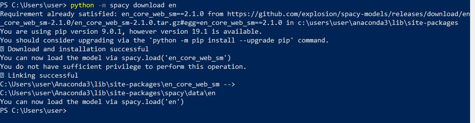
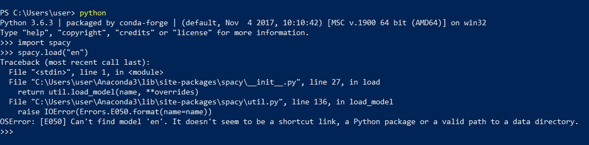

Troubleshooting FAQ
===================

General checks
^^^^^^^^^^^^^^
- Check that you are using the latest version of ConvoKit
- Verify that your installed package dependencies for ConvoKit satisfy `ConvoKit's versioning requirements <https://github.com/CornellNLP/ConvoKit/blob/master/requirements.txt>`_
- If possible, use a Unix system, i.e. Mac OS or the Linux distros. We advise against using Windows, but Windows speakers may consider using the Windows subsystem for Linux (WSL) instead.

Issues
^^^^^^

**Error associated with Numpy**

ConvoKit currently requires Numpy 1.x.x, as Numpy 2.x is known to cause compatibility issues. Please verify your Numpy version. We are working on supporting Numpy 2.x and appreciate your understanding.

-----------------------------

**OSError: [E050] Can't find model 'en'. It doesn't seem to be a shortcut link, a Python package or a valid path to a directory.**

As mentioned in the installation instructions, one needs to run "python -m spacy download en" so that a model 'en' exists.

However, there is a secondary issue specific to Windows machines:

-----------------------------

**python -m spacy download en** appears successful but actually fails to link the downloaded model to spaCy [Windows]

The output from the command suggests that linking is successful and that *spacy.load('en_core_web_sm')* should succeed. However, a closer inspection of the first set of outputs reveals an error message: "You do not have sufficient privilege to perform this operation."

The operation referred to is the linking of 'en'. This issue has been raised `here <https://github.com/explosion/spaCy/issues/1283>`_ and has been acknowledged as a bug.

The solution is to either do the installation in a virtualenv (where the privileges required for linking is lower) or run powershell as administrator.

-----------------------------

**error: Microsoft Visual C++ 14.0 is required.** when installing SpaCy [Windows]

SpaCy, one of ConvoKit's dependencies, itself has an assortment of dependencies (e.g. murmurhash, cytoolz.) On Windows, these must be built using Microsoft Visual C++ build tools to be built properly.

The build tools can be downloaded `from Microsoft here <https://visualstudio.microsoft.com/downloads/#build-tools-for-visual-studio-2019>`_. Take care to not `confuse these tools with other Microsoft distributables <https://github.com/explosion/spaCy/issues/2441>`_.

-----------------------------

**error: command 'gcc' failed with exit status 1** [Mac OS]

This is an error encountered when installing the SpaCy dependency for ConvoKit on MacOS. The solution is to link the required C++ standard library explicitly, like so:

>>> CFLAGS=-stdlib=libc++ python3 -m pip install convokit

-----------------------------

**urlopen error [SSL: CERTIFICATE_VERIFY_FAILED] certificate verify failed** [Mac OS]

This is an error encountered when using the ``convokit.download()`` function without having SSL certificates properly set up.

An explanation for this error is detailed in this `site <https://timonweb.com/tutorials/fixing-certificate_verify_failed-error-when-trying-requests_html-out-on-mac/>`_.

The two recommended fixes are to run:

>>> pip install --upgrade certifi

and if that doesn't fix the issue, then run:

>>> open /Applications/Python\ 3.8/Install\ Certificates.command

(Substitute 3.8 in the above command with your current Python version (e.g. 3.9 or 3.10) if necessary.)

Immutability of Metadata Fields
^^^^^^^^^^^^^^^^^^^^^^^^^^^^^^^^
Starting with 3.0, ConvoKit disallows mutation on Metadata fields to prevent unintended data loss and ensure the integrity of the corpus metadata backend storage.
When accessing a Metadata field, a deep copy of the field is returned to prevent mutation changes to the copy from affecting the backend storage.
This behavior is intended to ensure consistency between DB and MEM modes, since permitting mutations to mutable metadata fields in DB mode would solely modify the in-memory data without updating the database, thereby risking potential data loss.

Therefore, all metadata values must be treated as *immutable*. This does not really make a difference for primitive values like ints and strings,
since those are immutable in Python to begin with. However, code that relies on mutating a more complex type like lists or dictionaries may not work as expected.
For example, suppose the metadata entry ``"foo"`` is a list type, and you access it by saving it to a Python variable as follows:

>>> saved_foo = my_utt.meta["foo"]

Because lists are considered mutable in Python, you might expect the following code to successfully add a new item in the ``foo`` metadata of ``my_utt``:

>>> saved_foo.append("new value")

However, it will not work starting with the 3.0 version of ConvoKit; the code will run, but only the variable ``saved_foo`` will be affected, not the actual metadata storage of ``my_utt``.
This is because ``saved_foo`` only contains a copy of the data from the backend storage.
Thus, any operations that are done directly on ``saved_foo`` are done only to the copy, and do not involve any backend storage writes.

It is therefore necessary to treat *all* metadata objects, regardless of type, as immutable.
Thus, the way to change metadata is the same way you would change an int or string type metadata entry: that is, by completely overwriting it.
For example, to achieve the desired effect with the ``"foo"`` metadata entry from above, you should do the following:

>>> temp_foo = my_utt.meta["foo"]
>>> temp_foo.append("new value")
>>> my_utt.meta["foo"] = temp_foo

By adding the additional line of code that overwrites the ``"foo"`` metadata entry, you are telling ConvoKit that you want to update the value of ``"foo"`` in the storage’s metadata table with a new value, represented by ``temp_foo`` which contains the new additional item.
Thus the contents of ``temp_foo`` will get written to the backend storage as the new value of ``my_utt.meta["foo"]``, hence updating the metadata as desired.
